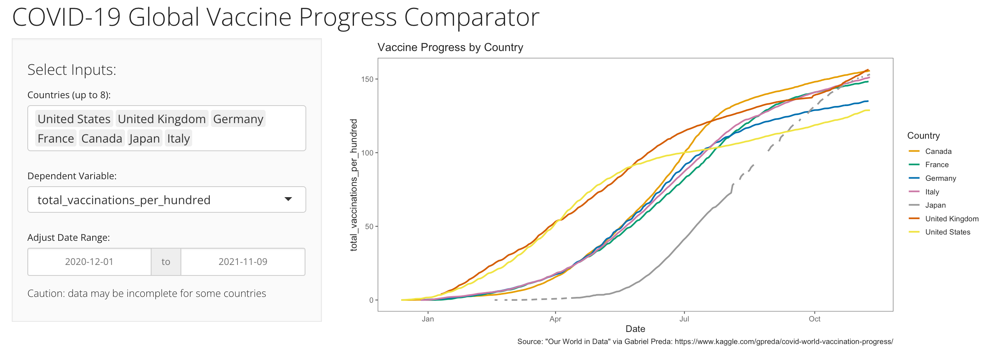

# vaccine_progress_app

# Project Summary
* Created an interactive Shiny web application in R that reads in a global vaccination dataset and visualizes vaccination progress between up to eight countries at a time.
* Built a simple UI with interactive inputs, allowing users to search for an select countries and dependent variables.
* Coded a reactive ggplot2 visualization that compares time series data across countries
* Adapted an R script to pull regularly updated vaccine data from Kaggle.com.
* Performed simple data cleaning and manipulation with dplyr.
* Hosted the app on shinyapps.io
